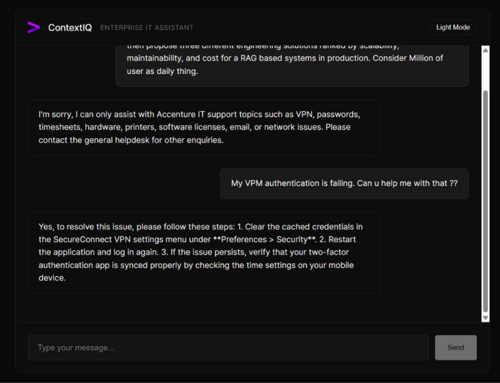
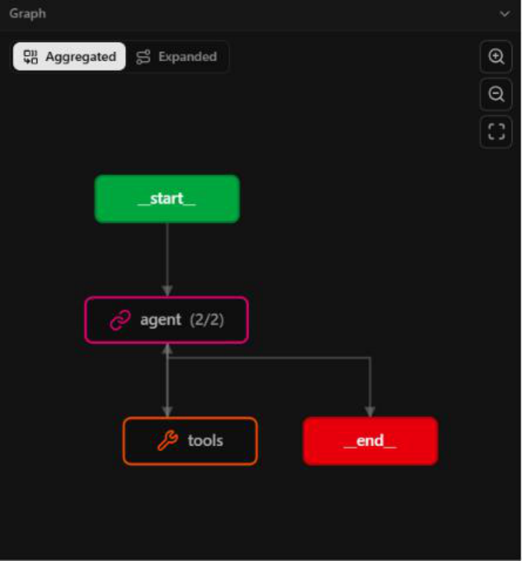
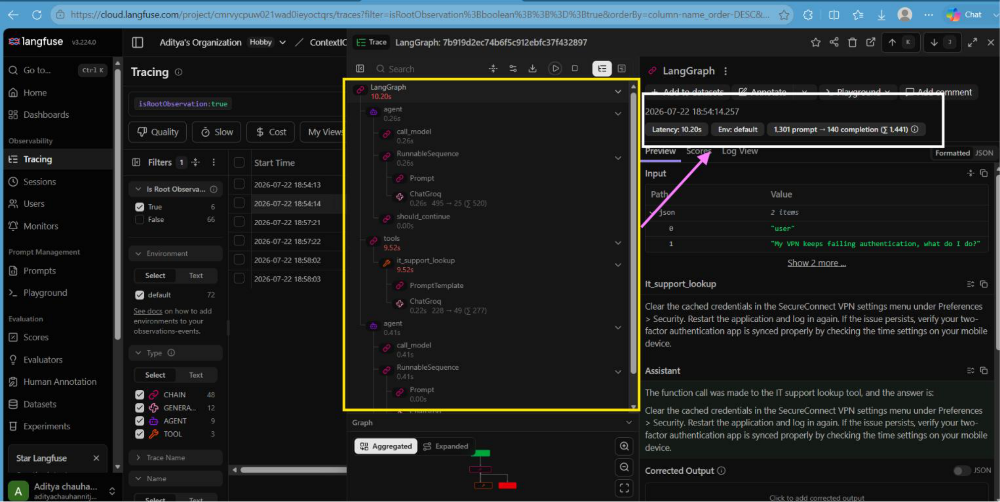
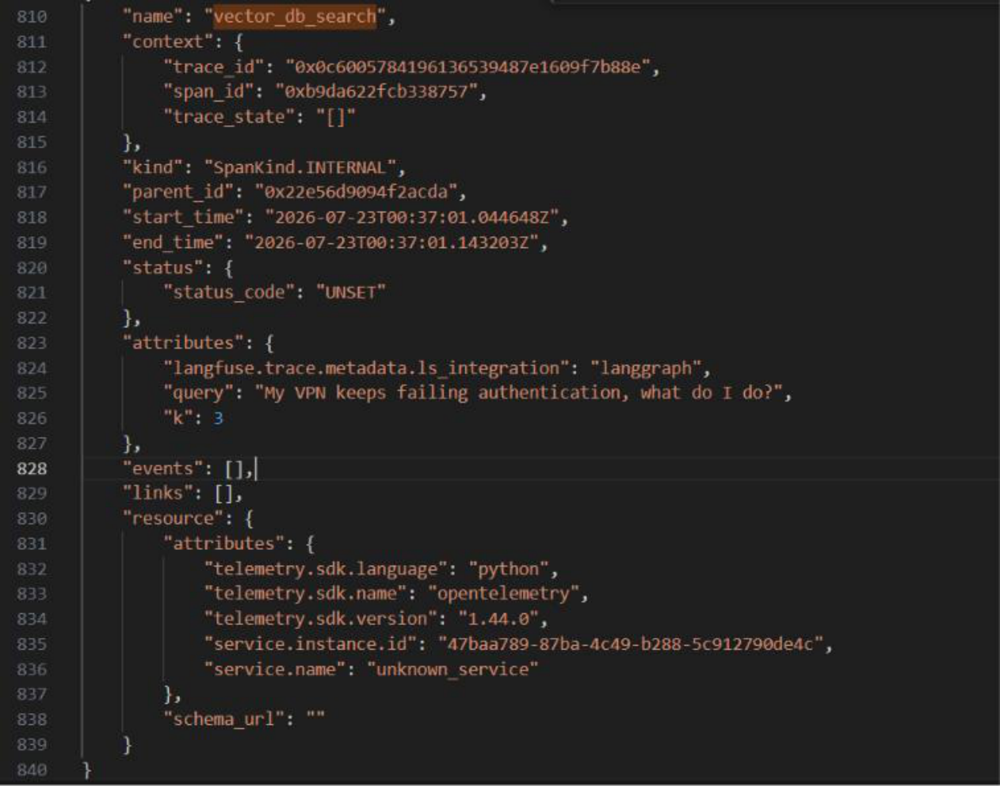

<div align="center">
  <h1>🧠 ContextIQ</h1>
  <p><strong>Enterprise IT Support Agent — Powered by LangGraph, Groq, and ChromaDB</strong></p>
  
  [](https://fastapi.tiangolo.com/)
  [](https://reactjs.org/)
  [](https://langchain.com/)
  [](https://opentelemetry.io/)
</div>

<div align="center">
  <b><a href="https://context-iq-frontend-seven.vercel.app/">🌐 Try the Live App</a></b> | 
  <b><a href="https://youtu.be/iB0DpAtEWZA?si=DufV_p64cXk-fUmC">🎥 Watch the Video Demo</a></b> | 
  <b><a href="https://docs.google.com/presentation/d/1YjKR_LsQPGX68dEUOVmqeWUsBH6sl-gq/edit?usp=sharing&ouid=105688022393717157912&rtpof=true&sd=true">📊 View the Presentation (PPT)</a></b>
</div>

---

## 📖 Overview

**ContextIQ** is a production-grade, stateful AI agent built to automate internal enterprise IT support. Instead of a simple "blind" RAG chain, ContextIQ uses a **ReAct Agent architecture (via LangGraph)** to intelligently route queries, eliminate out-of-scope hallucinations, and save API tokens. 

It acts as a gatekeeper: if an employee asks about a VPN failure, it pulls historical IT tickets from ChromaDB to solve it. If they ask for the capital of France, it rejects the query instantly without hitting the database.



---

## 🏗️ Architecture & Design Choices

### 1. LangGraph ReAct Agent (vs. Simple RAG)
We deliberately chose to build a **ReAct Agent** rather than a standard RAG pipeline. 
* **The Problem:** Standard RAG pipelines embed every user query and hit the vector database regardless of the topic, leading to hallucinations on non-IT questions and wasted tokens.
* **The Solution:** ContextIQ uses an LLM Agent that reads a strict "Tool Docstring". The agent *thinks* first. It evaluates if the question falls within 8 strict IT categories. If it does, it calls the `it_support_lookup` tool. If not, it rejects it immediately.



### 2. A/B Testing & Config-Driven Design
The system is designed for rapid experimentation via `.env` files without changing application code.
* **LLM Hot-Swapping:** Switch between `gemini-3.5-flash` and `llama-3.1-8b` (via Groq) instantly.
* **Retrieval Strategies:** Test `metadata_chunk` vs `parent_document` retrieval on the fly.
* **Chunking Configurations:** Adjust `CHUNK_SIZE`, `CHUNK_OVERLAP`, and `K_RESULTS` easily to measure impact on token limits and accuracy.

---

## 📊 Full-Stack Observability

An enterprise system is only as good as its observability. ContextIQ layers observability across the entire stack to ensure zero blind spots.

### Langfuse (LLM Application Layer)
We use Langfuse to track the AI's reasoning, token usage, and prompt latency. We score prompt quality directly in the Langfuse dashboard during our A/B tests.


### OpenTelemetry (Infrastructure Layer)
Langfuse only wraps the LLM calls—it is blind to pure database latency. We instrumented ChromaDB with OpenTelemetry (OTel) to capture exact Vector DB search latency (e.g., 99ms lookups). 
*Note: A Singleton pattern was implemented for the OTel `TracerProvider` to prevent memory leaks during the FastAPI lifecycle.*


---

## 🚀 Deployment Guide (Vercel + Render)

This project is configured to run the React frontend on **Vercel** and the FastAPI backend on **Render**.

### 1. Backend Deployment (Render)
Render free-tier spins down after 15 minutes of inactivity. ContextIQ handles this gracefully.
1. Create a new **Web Service** on Render.
2. Connect this GitHub repository.
3. Set the Root Directory to `backend/`.
4. Build Command: `pip install -r requirements.txt`
5. Start Command: `uvicorn app.main:app --host 0.0.0.0 --port 10000`
6. **Environment Variables:** Add all variables from your local `.env` (Groq/Gemini API keys, Langfuse keys, etc.).

### 2. Frontend Deployment (Vercel)
The frontend includes a "Wakeup Ping" (`useEffect` in `App.jsx` hitting `/health`) so that the moment a user visits the Vercel site, it wakes up the Render backend.
1. Create a new Project on Vercel.
2. Connect this GitHub repository.
3. Set the Root Directory to `frontend/`.
4. Build Command: `npm run build`
5. **Environment Variables:** Add a new variable called `VITE_API_URL` and paste your Render URL (e.g., `https://contextiq-api.onrender.com`).

---

## 🛠️ Local Development

### Prerequisites
- Python 3.10+
- Node.js 18+

### Backend Setup
```bash
cd backend
python -m venv venv
source venv/Scripts/activate  # (Windows Git Bash)
pip install -r requirements.txt

# Run the backend
python -m app.main
```

> **Note on ChromaDB:** The `chroma_db/` directory is intentionally ignored in `.gitignore` due to its massive file size. After setting up the backend, you must run the ticket ingestion/parser script (e.g., `python -m app.core.ticket_parser`) to process `dummy_it_tickets.txt` and generate your local vector database before querying the agent.

### Frontend Setup
```bash
cd frontend
npm install

# Run the frontend
npm run dev
```

---

<div align="center">
  <i>Built with ❤️ during the SAP BTP Core Team Internship (AEH Batch)</i>
</div>
